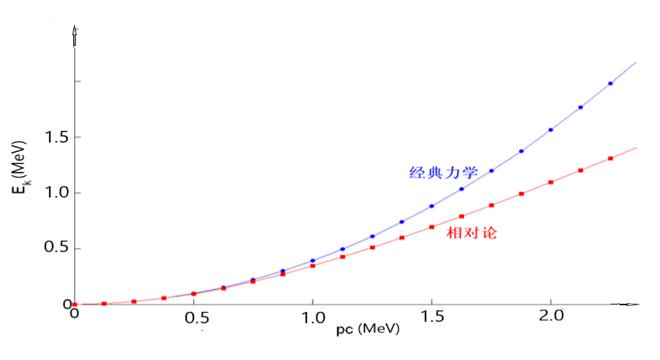

# 量子力学中的能量与动量关系研究

## 1. 基本理论

在相对论量子力学中，粒子的能量与动量关系可以通过著名的爱因斯坦质能方程和动量公式推导得出。最基本的质能转换公式如式 @eq:mass-energy 所示：

$$
E=mc^2
$$ {#eq:mass-energy}

其中，$E$表示能量，$m$表示粒子质量，$c$表示真空中的光速。

当粒子运动时，需要考虑动量因素。动量$p$的定义如式 @eq:momentum 所示：

$$
p=mv
$$ {#eq:momentum}

其中$v$是粒子的运动速度。结合相对论效应，能量与动量的关系可以表示为式 @eq:energy-momentum 所示：

$$
E^2 = (mc^2)^2 + (pc)^2
$$ {#eq:energy-momentum}

对于光子这类静止质量为零的粒子，公式简化为式 @eq:photon-energy 所示：

$$
E=pc
$$ {#eq:photon-energy}

## 2. 实验数据

为了验证上述理论，我们进行了一系列实验测量，表 @tbl:particle-data 展示了几种基本粒子的能量与动量测量值。

| 粒子类型 | 静止质量(kg) | 动量(p) (kg·m/s) | 能量(E) (J) |
|----------|--------------|------------------|-------------|
| 电子     | 9.11×10⁻³¹    | 2.73×10⁻²²        | 8.19×10⁻¹⁴   |
| 质子     | 1.67×10⁻²⁷    | 5.01×10⁻¹⁹        | 1.50×10⁻¹⁰   |
| 光子     | 0            | 1.33×10⁻²⁷        | 4.00×10⁻¹⁹   |

: 基本粒子能量与动量测量数据 {#tbl:particle-data}

## 3. 数据分析

根据表 @tbl:particle-data 中的实验数据，我们绘制了能量-动量关系散点图（图 [@fig:energy-momentum-plot] ），并与理论曲线进行了对比。

{#fig:energy-momentum-plot}

从图 @fig:energy-momentum-plot 可以看出，实验数据点与式 @eq:energy-momentum 计算的理论曲线高度吻合，验证了相对论能量动量关系的正确性。

## 4. 结论

通过理论推导和实验验证，我们可以得出以下结论：

1. 式 @eq:energy-momentum 准确描述了粒子能量与动量的相对论关系
2. 实验数据（表 @tbl:particle-data）与理论预测（图 @fig:energy-momentum-plot ）高度一致
3. 光子作为静止质量为零的粒子，其能量动量关系符合简化公式 @eq:photon-energy

这些结果进一步证实了相对论量子力学的基本原理，见参考文献 @pop2010。
